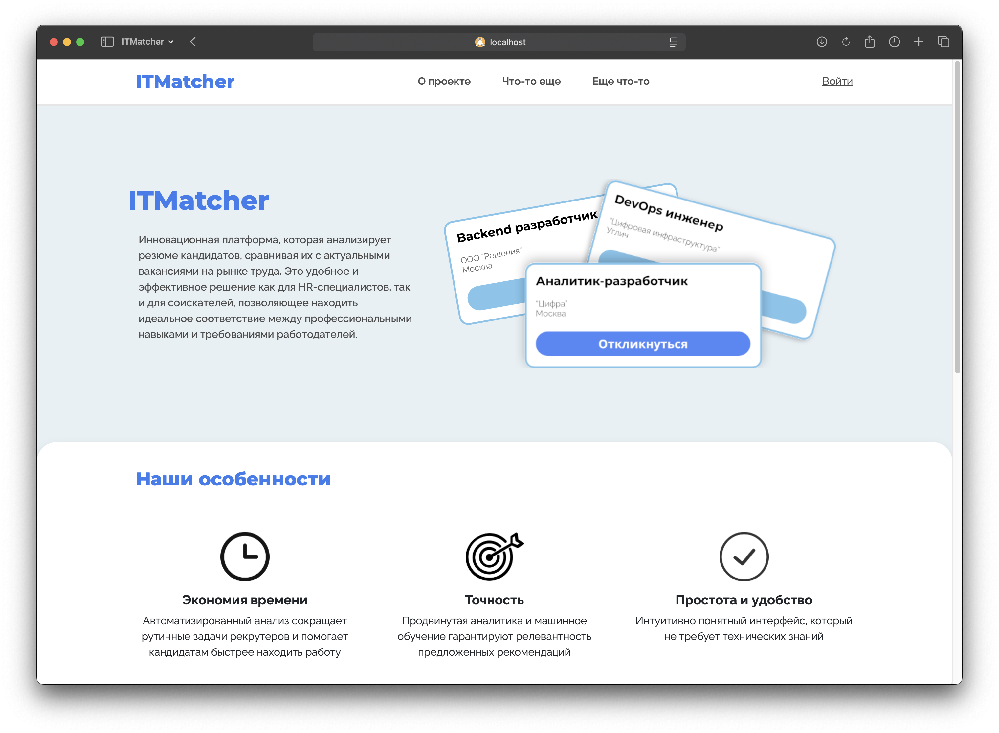

# ITMatcher



## Описание проекта
ITM (ITMatcher) - это система для анализа резюме соискателей и сопоставления их с вакансиями на основе навыков. Проект предназначен для автоматизации процесса подбора кандидатов для HR-специалистов и помощи соискателям в поиске подходящих вакансий.

## Функциональные возможности
- Автоматический анализ резюме с помощью AI-модели
- Извлечение hard и soft навыков из резюме
- Сопоставление навыков соискателя с требованиями вакансий
- Ранжирование вакансий по степени соответствия навыкам соискателя
- Автоматический подбор трех наиболее подходящих вакансий для соискателя
- Различные роли пользователей (HR и соискатели)
- REST API для интеграции с другими системами

## Технологический стек
### Backend (Go)
- **Gorilla/mux** - мощный HTTP роутер и диспетчер для создания RESTful API
- **PostgreSQL** - надежная реляционная СУБД для хранения данных о пользователях, вакансиях и резюме
- **golang-migrate** - инструмент для управления миграциями базы данных
- **gorilla/sessions** - библиотека для управления пользовательскими сессиями
- **bcrypt** - для безопасного хранения паролей с использованием хеширования
- **agnivade/levenshtein** - для нечеткого сопоставления навыков с учетом возможных опечаток

### NLP и AI-компонент (Python)
- **FastAPI** - современный высокопроизводительный веб-фреймворк для создания API на Python
- **SpaCy** - самостоятельно обученная модель для обработки естественного языка и извлечения навыков из текста резюме
- **SpaCy-Transformers** - расширение для SpaCy, интегрирующее модели трансформеров (BERT, RoBERTa) для улучшения распознавания сущностей
- **Transformers** - библиотека, предоставляющая предобученные модели для NLP задач
- **PyTorch** - фреймворк глубокого обучения, используемый как бэкенд для трансформеров
- **Uvicorn** - ASGI-сервер для запуска приложения FastAPI

### Frontend
- **HTML/CSS** - для создания пользовательского интерфейса
- **Bootstrap** - для ускорения разработки и стилизации интерфейса

## Архитектура системы

### Компоненты
- **Go-сервер** (основной сервис) - обрабатывает HTTP-запросы, взаимодействует с БД и AI-микросервисом
- **Python AI-микросервис** - обрабатывает тексты резюме и извлекает навыки с помощью NLP модели SpaCy
- **База данных PostgreSQL** - хранит данные о пользователях, вакансиях, резюме и навыках

### Взаимодействие компонентов
Go-сервер отправляет текст резюме на обработку в Python AI-микросервис через HTTP POST-запрос на эндпоинт `/analyze`. AI-сервис анализирует текст, извлекает hard и soft навыки, и возвращает их в формате JSON. Затем Go-сервер сохраняет полученные навыки в базе данных и использует их для сопоставления с вакансиями.

### Алгоритм подбора вакансий
Система использует следующий алгоритм для подбора наиболее подходящих вакансий:
1. Извлечение hard и soft навыков из резюме с помощью SpaCy-модели
2. Сопоставление извлеченных навыков с требованиями каждой вакансии
3. Вычисление процента соответствия на основе совпадающих навыков
4. Сортировка вакансий по проценту соответствия
5. Выбор трех вакансий с наибольшим процентом соответствия
6. Сохранение результатов анализа для последующего отображения пользователю

Для сопоставления навыков используется алгоритм Левенштейна, позволяющий учитывать возможные опечатки и разные варианты написания одного и того же навыка.

## Установка и запуск

### Требования
- Go (версия 1.15+)
- PostgreSQL (версия 12+)
- Python (версия 3.12.9)
- SpaCy и другие Python-библиотеки для NLP

### Настройка и запуск
1. Клонировать репозиторий:
   ```
   git clone https://gitverse.ru/Linares/gaspr_case.git
   cd gaspr_case
   ```

2. Настроить файл `.env` на основе `.env_example`.

3. Запустить PostgreSQL и создать базу данных `projectDB`

4. Установить зависимости:
   ```
   go mod download
   pip install -r requirements.txt
   ```

5. Запустить Python AI-микросервис:
   ```
   cd server
   python ai_api.py
   ```

6. Запустить Go-сервер в отдельном терминале:
   ```
   go run server/main.go
   ```

## Структура проекта
```
gaspr_case/
├── data/            # Тестовые данные
├── server/          # Основной код сервера
│   ├── ai_api.py    # Python AI микросервис для анализа резюме (FastAPI)
│   ├── db/          # Пакет для работы с базой данных
│   ├── handlers/    # HTTP обработчики
│   ├── models/      # Структуры данных
│   ├── services/    # Дополнительные сервисы
│   ├── output/      # Модель NLP
│   │   └── ai/      # Клиент для взаимодействия с AI-микросервисом
│   │   └── analysis/# Модуль для анализа и сопоставления навыков
│   ├── main.go      # Точка входа Go-сервера
```

## AI-модель для анализа резюме

Проект использует самостоятельно обученную SpaCy-модель с интеграцией трансформеров для анализа текста резюме и извлечения навыков. Модель обучена распознавать два типа сущностей:
- **HARDSKILL** - технические навыки (языки программирования, технологии, инструменты)
- **SOFTSKILL** - гибкие навыки (коммуникация, лидерство, работа в команде)

### Особенности модели:
- Использование архитектуры **SpaCy-Transformers**, сочетающей эффективность SpaCy с мощью моделей трансформеров
- Применение предобученной языковой модели для русского языка, дообученной на специфичных для HR-сферы текстах
- Обработка контекста для точного определения навыков в различных формулировках
- Нормализация навыков для устранения вариативности написания через специализированные словари
- Фильтрация стоп-слов и нерелевантных терминов

Модель обучена на собственном наборе размеченных резюме и описаний вакансий, что обеспечивает высокую точность в распознавании профессиональных навыков в контексте IT и других технических областей.

## API Endpoints

### Аутентификация и общие
- `POST /api/register` - Регистрация пользователя
- `POST /api/auth` - Вход пользователя
- `GET /api/logout` - Выход пользователя

### AI-микросервис
- `POST http://localhost:8001/analyze` - Анализ текста резюме (внутренний API, вызывается Go-сервером)

### Внешние (публичные) API
- `POST /api/send_resume` - Отправка резюме для анализа из внешнего сервиса (возможна интеграция)

### HR API
- `GET /api/hr/resume/{id}` - Получение данных о конкретном резюме
- `GET /api/hr/resumes` - Получение списка всех резюме для HR
- `POST /api/hr/add_vacancy` - Создание новой вакансии
- `POST /api/hr/add_finder` - Добавление нового соискателя
- `GET /api/hr/finder/{finder_id}/{vacancy_id}` - Получение данных анализа резюме для конкретной вакансии
- `GET /api/hr/vacancy/{vacancy_id}` - Получение информации о вакансии

### Соискатель API
- `GET /api/finder/resumes` - Получение списка загруженных резюме для пользователя
- `GET /api/finder/resume/{resume_id}` - Получение информации о конкретном резюме
- `POST /api/finder/add_resume` - Загрузка нового резюме и получение трех наиболее подходящих вакансий

## Авторы
- [Linares](https://gitverse.ru/Linares)